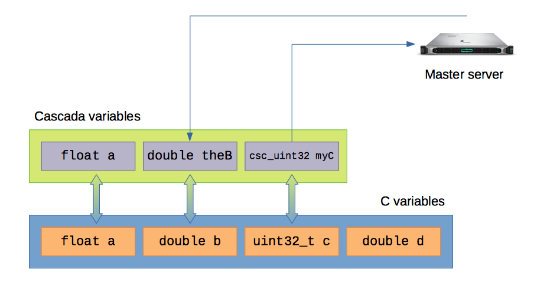

# cascada-client (cruesli)

> A C connector to Cascada


## Basic Overview

This connector enables you to easily connect to an existing Cascada master server. Receive tasks and send results seamlessly with minimal modifications to existing code.

## Install

### Dependancies

To use cruesli, you'll need the following C libraries
- libcurl
- libcjson
- libpthread

### Compiling the minimal example client (slave server)
 
1. Clone the repo
2. `make all`

That's it ! The library `libruesli.so` will be built in the `build/` directory; relevant headers will be copied in `build/cruesli/` and a test client named `client` will also be built (see below). To install `libcruesli`, use `make install`

This slave server has been tested on both macOS and Linux. It won't compile on Windows, essentially because of `_POSIX_HOST_NAME_MAX`: replace it by a rather large number and it should work.

The example slave server will attempt to connect to a Cascada master server on `127.0.0.1:8088`, with password `ABRACADABRA`


## Usage

### How it works

In the following, it is assumed that you read the `README` for the Cascada master server.

#### Terminology

A Cascada slave server is build around computation nodes. The distant master server can allocate a task for each node. Because of increasingly parallelization-capable hardware, it is often interesting performance-wise to run several computation nodes on the same machine, for instance as threads in the same slave server process.

However, some tasks are not relevant to the performing of computations, such as authentification, disconnection, etc. They are only done once, while still affecting each node. To make things smoother and more elegant, the nodes are logically grouped in an entity that's refered to as a **master client**, just like related files (the nodes) would belong in the same folder (the master client). Because there is exactly one master client for each slave server process, these terms are used interchanbly.

This entity is mainly reponsible for several tasks:
- Authentification
- Asking the server to allocate nodes

The code in the threads doing the computations (which would be the nodes) will be in charge when it comes to fetching new times and submitting its  

Keep in mind that this only a view of the mind. For instance, if OpenCL is used to offload computations to the GPU, the master client running on the CPU would also have to submit the tasks, and read the new tasks.

The programmer is rather free to decide how he or she wants to set things up. While this might seem a bit confusing at first, reading the code will make things clearer.


#### Variable binding

How can the slave server dynamically know which variable should be read from the master server and sent to the master server ?

Cruesli uses an intermediate variable context. The programmer only has to register the C variables in the context as a Cascada variable. That way, they are exposed to the master server: it is possible to seamlessly read the value of the C variables (to send the result of computations) or write to them (to update their value to perform a new task) from the Cascada layer.




In this example, the C variable `a` is bound the Cascada variable `a`, the C variable `b` is bound to the Cascada variable `theB`and the C variable `c` is bound to the Cascada variable `myC`. Notice that the Cascada type corresponding to the C type `uint32_t` is `csc_uint32`. A complete list of types is available in the README of the Cascada master server.

The master server defines the value taken by `theB`. Cruesli loads said value in `b`. The computation node does its computations; the result is stored in `c` and `a`, but the server only needs a value for `myC`. Cruesli knows that the value of `myC` is to be read in `c`, and sends the value of `c`.

What's great with this approch is that the programmer does not need to know the precise need of the master server at compile time, but only a set of variable it _might_ need. If the needs of the server were to change (say that the master server wants to read both `a` and `myC`, or only `a`), said needs could (theorically, the server should notify the program of the change and that is currently not implemented) be satisfied immediately, without even having to restart the program !


### Code


We're now going to write the client code for project used in the README for the Cascada server.

There's only one header to inlude to be able to use cruesli: `<cruesli/cruesli.h>`. Don't forget to link your program to `libcruesli` !

On to the actual code (the complete source code is avaible in `src/client/main.c`)... 

```
    csc_master_info info = init_cruesli(
            "127.0.0.1:8088",
            "ABRACADABRA"
    );
    connecter_cascada(&info, "theHostname");
    allouer_noeuds(&info, 8);
```

We start by intializing cruesli (`init_cruesli()`). The `info` variable plays a role akin to the one of a curl_easy handle. It materializes the **master client**.

Then, the program connects to the Cascada server (`connecter_cascada()`); "theHostname" is used as the preferential name the master server should give to our master client.

Finally, we ask the server to allocate at most 8 nodes for us (`allouer_noeuds()`). We may get less nodes, depending on the server.

That's it ! We're connected to the server and are ready to receive tasks. To perfoms computations, we are going to use threads.

We define a struct containing all the infos the nodes will need.

```
typedef struct csc_th_spawn_info {
    csc_node_info* nodeinfo;
    csc_master_info* masterinfo;
    pthread_t threadid;
} csc_th_spawn_info;
```

And we'll spawn the threads (ie nodes).

```
    csc_th_spawn_info** th_info_list = safe_malloc(sizeof(csc_th_spawn_info*)*NB_TH);
    csc_node_info* spawner = info.nodes;
    
    int i = 0;
    while(spawner){
        th_info_list[i] = safe_malloc(sizeof(csc_th_spawn_info));
        th_info_list[i]->masterinfo = &info;
        th_info_list[i]->nodeinfo   = spawner;
        
        pthread_create(&(th_info_list[i]->threadid), NULL, (void*)th_calcul, th_info_list[i]);
        spawner = spawner->next;
        i += 1;
    }
```

Notice that we did not really on the number of threads we asked the server to allocate but on the number of nodes actually allocated.

All the hard work is done by the `th_calcul()` function: let's break it down.

```
void th_calcul(csc_th_spawn_info* inf){
    
    csc_master_info* masterinfo = inf->masterinfo;
    csc_node_info*   monnoeud   = inf->nodeinfo;
    
    float X = 0;
    float Y = 0;
    float Z = 0;
    float d = 0;
    
    int code = 0;
    
    printf("Thread succesfully spawned !\n");
    
    ajouter_variable(VARTYPE_FLOAT, "X", &X, monnoeud->localvars);
    ajouter_variable(VARTYPE_FLOAT, "Y", &Y, monnoeud->localvars);
    ajouter_variable(VARTYPE_FLOAT, "Z", &Z, monnoeud->localvars);
    ajouter_variable(VARTYPE_FLOAT, "mE", &d, monnoeud->localvars);

    while(!code){
        code = allouer_travail(masterinfo, monnoeud);
        if(!code){
            d = (-1)*(sqrtf(X*X + Y*Y + Z*Z)+1);
            code = soumettre_travail(masterinfo, monnoeud);
            if(code)
                printf("Submission failed !\n");
        } else {
            if(code == 7)
                printf("No more work \\°_°\\ \n");
            else
                printf("Couldn't allocate work ! (nothing to do with malloc...)\n");
        }
        
    }

    return;
    
}
```

First off, we extract the values from the `csc_th_spawn_info` that was provided. We then declare our C variables (`float ... = 0`), and more interestingly, we **bind** them to Cascada variables (`ajouter_variable()`), by providing:
- The Cascada variable type
- The Cascada variable name
- A pointer to the C variable
- The Cascada context/variable list to store it

The `VARTYPE_...` are as follows

| Casada type | `VARTYPE_...` |
|-|-|
|`csc_float`| `VARTYPE_FLOAT`|
|`csc_double`| `VARTYPE_DOUBLE`|
|`csc_uint64`| `VARTYPE_U64`|
|`csc_uint32`| `VARTYPE_U32`|
|`csc_uint8` | `VARTYPE_U8`|
|`csc_int64` | `VARTYPE_I64`|
|`csc_int32` | `VARTYPE_I32`|


We then ask the master server to give the node work (`allouer_travail()`). The values of the variables generated by the server are automatically written to the corresponding C variables.

Once the computation is done, `soumettre_travail()` automatically sends the exepcted values to the server.

That's it ! Take a look at `src/client/main.c` to see the complete, functional, example ! The compiled example client is avaible in the `build` directory. If you've not installed the library yet, be sure to add the absolute path to the `cruesli` directory to `LD_LIBRARY_PATH`.


#### How do I know how to name my Cascada variables ?

Well, the most reliable way is to decide for a given algorithm which variable names you are going to use both on the master server and on the slave servers. Remember that the server sends the name of the algorithm used; it is stored in the `csc_master_info`.  